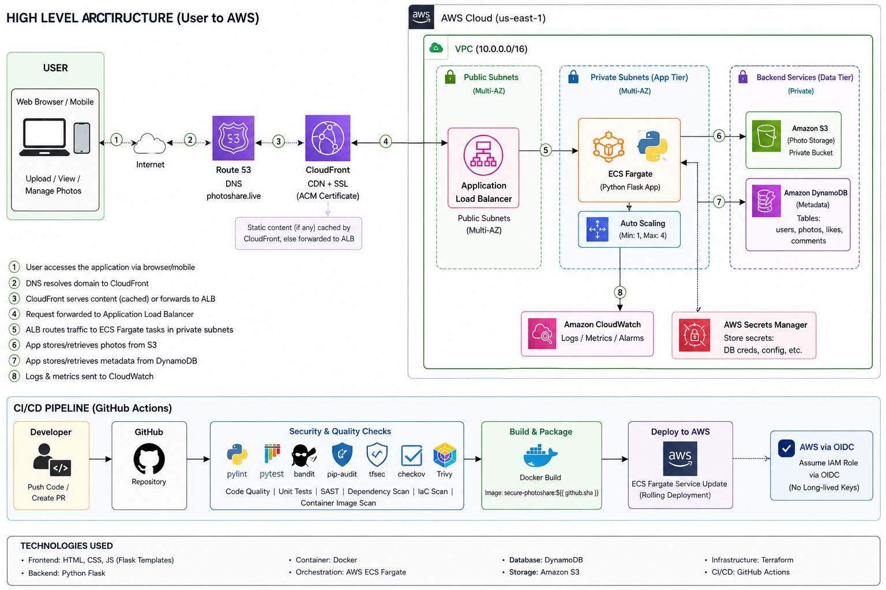
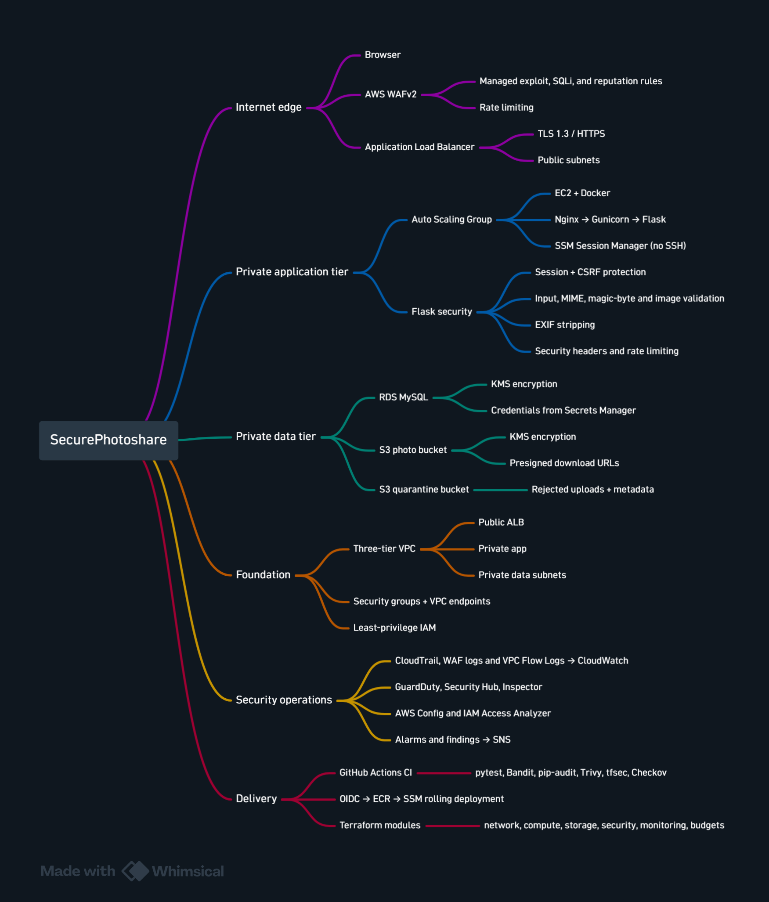
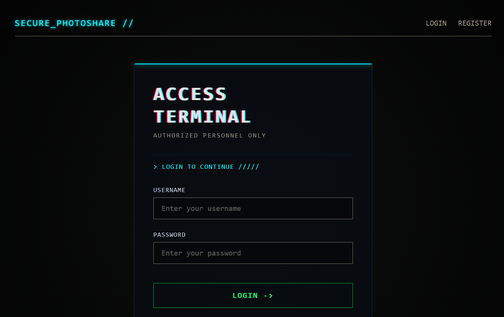
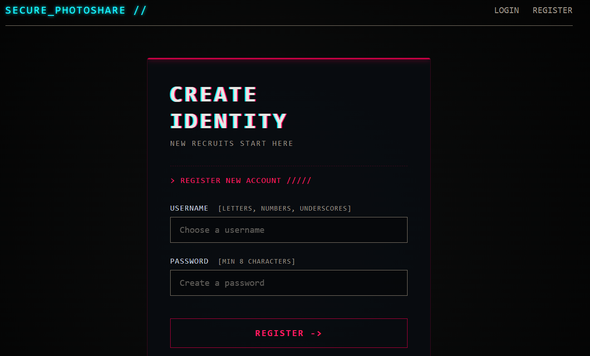
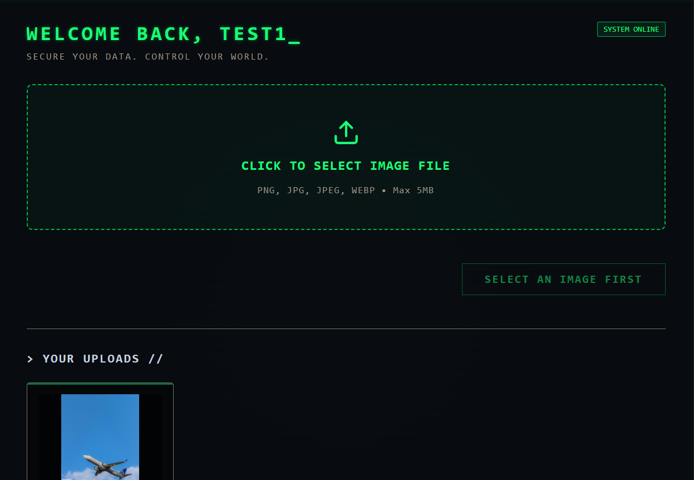

# SecurePhotoshare — AWS Security Engineering Project

A security-hardened photo sharing application deployed on AWS, demonstrating defense-in-depth across infrastructure, application, and CI/CD layers.

## Architecture



## Security Controls Implemented

### Application Layer
| Control | Implementation |
|---------|---------------|
| Authentication | Scrypt password hashing, session management |
| CSRF Protection | Flask-WTF token on all state-changing forms |
| Input Validation | Extension + MIME + magic bytes + Pillow verify |
| EXIF Stripping | Metadata removed before storage (privacy) |
| Security Headers | CSP, X-Frame-Options, Referrer-Policy, and HSTS when HTTPS is enabled |
| Rate Limiting | Per-IP limits on auth (10/min) and uploads (10/min) |
| Quarantine | Invalid uploads isolated with rejection metadata |
| Audit Logging | Structured logs with request IDs for every action |
| SQL Injection | Parameterized queries via PyMySQL |
| XSS | Jinja2 auto-escaping + CSP |

### Infrastructure Layer
| Control | Implementation |
|---------|---------------|
| Encryption at Rest | KMS CMK with auto-rotation (S3, RDS, EBS) |
| Encryption in Transit | TLS 1.3 when HTTPS is configured; S3 bucket policies deny insecure transport |
| Network Isolation | 3-tier VPC, SG-to-SG refs, no public DB |
| IAM Least Privilege | Prefix-scoped S3, KMS via-service condition |
| Secrets Management | Secrets Manager, no hardcoded credentials |
| WAF | Rate limiting, SQLi, IP reputation, common exploits |
| SSH-less Access | SSM Session Manager, no SSH keys |

### Detection & Monitoring
| Service | Purpose |
|---------|---------|
| CloudTrail | API audit trail + S3 data events |
| GuardDuty | Optional threat detection with S3 protection |
| Security Hub | Optional centralized findings and best-practice checks |
| Inspector | Optional CVE scanning for EC2 and containers |
| AWS Config | 8 compliance rules (encryption, public access, MFA) |
| IAM Access Analyzer | External access detection |
| VPC Flow Logs | Network traffic analysis |
| CloudWatch Alarms | CPU, 5xx, unhealthy targets, RDS metrics |

### CI/CD Security
| Stage | Tools |
|-------|-------|
| SAST | Bandit (Python security linter) |
| Dependency Scan | pip-audit (known vulnerabilities) |
| Container Scan | Trivy (CVE scan on Docker image) |
| IaC Scan | tfsec + Checkov (Terraform misconfigurations) |
| Supply Chain | Pinned dependencies, minimal base image |
| Deployment | OIDC auth (no long-lived keys), SSM deploy |

## Project Structure

```
├── app/                    # Application code
│   ├── app.py              # Flask application with security controls
│   ├── config.py           # Configuration (env-based, no secrets)
│   ├── Dockerfile          # Multi-stage, non-root, health-checked
│   ├── docker-compose.yml  # Local development stack
│   ├── nginx.conf          # Reverse proxy config
│   ├── schema.sql          # Database schema
│   ├── requirements.txt    # Pinned dependencies
│   └── templates/          # Jinja2 templates (auto-escaped)
├── terraform/              # Infrastructure as Code
│   ├── modules/
│   │   ├── network/        # VPC, subnets, endpoints, SGs
│   │   ├── storage/        # S3, RDS, KMS
│   │   ├── security/       # IAM roles and policies
│   │   ├── compute/        # ALB, ASG, Launch Template
│   │   └── monitoring/     # All detection services
│   └── *.tf                # Root module config
├── bootstrap/              # Terraform state bucket setup
├── tests/                  # pytest test suite
├── .github/workflows/      # CI/CD pipelines
│   ├── ci.yml              # Test + security scan on every PR
│   └── cd.yml              # Build → ECR → deploy on merge
├── docs/
│   └── THREAT_MODEL.md     # STRIDE-based threat analysis
└── README.md
```

## Running the Project

### Requirements

- AWS account with permissions to create the Terraform resources
- AWS CLI and Terraform installed locally
- GitHub repository with Actions enabled
- A verified email address for SNS budget and alert notifications

### 0. Clone the Repository

```powershell
git clone https://github.com/avengsum/secure_aws_photoshare.git
cd secure_aws_photoshare
```

### 1. Initialize the Terraform Backend

Before initializing the main Terraform project, create the remote state resources. The bootstrap configuration creates the encrypted S3 state bucket and DynamoDB lock table used by `terraform/backend.tf`.

```powershell
cd bootstrap
terraform init
terraform plan
terraform apply
```

Run this bootstrap step only when the backend resources do not already exist.

### 2. Configure Terraform

```powershell
cd terraform
# Copy the example file and rename the copy for your environment
Copy-Item terraform.tfvars.example terraform.tfvars
```

Update `terraform.tfvars` with your alert email and globally unique CloudTrail bucket name. The Terraform backend uses the S3 state bucket and DynamoDB lock table configured in `backend.tf`.

### 3. Create the AWS infrastructure

```powershell
terraform init
terraform validate
terraform plan
terraform apply
```

Terraform creates the VPC, private EC2 Auto Scaling Group, ALB, RDS, S3 buckets, KMS key, Secrets Manager secrets, ECR repository, monitoring services, IAM roles, and GitHub OIDC deployment role.

### 4. Configure GitHub OIDC

The Terraform OIDC provider trusts this repository and the `main` branch. In GitHub, add this Actions secret:

```text
AWS_DEPLOY_ROLE_ARN=arn:aws:iam::<account-id>:role/GitHubActionsDeployRole
```

The workflow uses short-lived OIDC credentials. No long-lived AWS access keys are stored in GitHub.

### 5. Deploy the application

Push changes to `main`:

```powershell
git add .
git commit -m "deploy application"
git push origin main
```

GitHub Actions runs CI checks, builds the Docker image from `app/Dockerfile`, scans it with Trivy, pushes an immutable image tag to ECR, and deploys it to EC2 through SSM. The deployment finishes only after the ALB target health check passes.

### 6. Access the application

After Terraform finishes, print the ALB address with:

```powershell
terraform output -raw alb_dns_name
```

Copy the displayed address into your browser. HTTPS requires a domain name and ACM certificate; the empty-domain configuration is the HTTP development fallback.

### 7. Controlled Force-Destroy

For a disposable environment only:

```powershell
cd terraform
.\destroy-sandbox.ps1
```

This removes the application infrastructure, images, photos, and database data after confirmation. Do not use it when data must be preserved.

## Design Decisions

| Decision | Rationale |
|----------|-----------|
| Flask over Django | Minimal attack surface, explicit security controls |
| Gunicorn over built-in server | Production-grade WSGI, proper signal handling |
| Scrypt over bcrypt | Modern KDF, memory-hard, built into Werkzeug |
| Quarantine bucket | Preserves evidence for incident response |
| EXIF stripping | Privacy by default — GPS/device data removed |
| VPC endpoints | AWS API calls never traverse public internet |
| Single KMS key | Simplified rotation and audit trail |
| SSM over SSH | No key management, full audit trail, IAM-based access |

## What This Project Demonstrates

- **Threat modeling** before implementation (see docs/THREAT_MODEL.md)
- **Defense in depth** — overlapping controls at every layer
- **Shift-left security** — scanning in CI before deployment
- **Least privilege** — minimal IAM, network isolation, non-root container
- **Secure SDLC** — from design to deployment to monitoring
- **Incident readiness** — audit trails, quarantine, alerting

## Known Limitations

- HTTPS requires a configured domain and ACM certificate.
- MFA is not implemented.
- Quarantined files are not scanned by antivirus yet.
- The design uses one NAT Gateway.
- GuardDuty, Security Hub, and Inspector are optional.

## Screenshots

Screenshots of the application and AWS architecture.


**Login**


**Register**



**Home**



---
